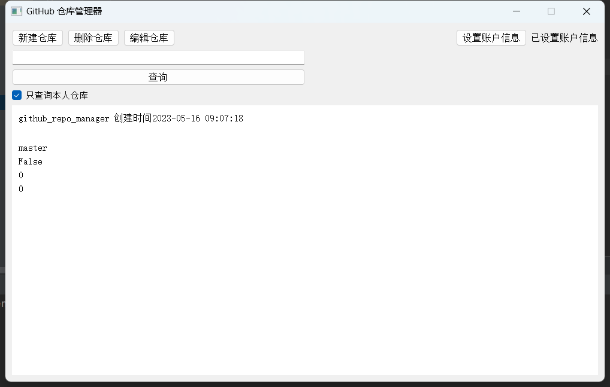

# PyQt5 GitHub 仓库管理器

本项目是一个使用 PyQt5 和 GitHub API 的仓库管理器，它提供了 GUI 界面，让用户可以方便地创建、删除和编辑 GitHub 仓库，还可以搜索自己的仓库或所有公共仓库。

## 项目结构

程序的主要逻辑在 `MainWindow` 类中实现，其中包括设置界面组件、读取配置文件、加载仓库列表、设置信号和槽等。程序使用了异步编程，通过 `asyncio` 库实现协程。

具体来说，`RepoManager` 类和 `GithubApiManager` 类分别封装了创建、删除、编辑和搜索 GitHub 仓库的 API 调用，这些调用都是异步的。程序还使用了 Python 标准库中的 `configparser` 模块来读取和写入配置文件，以保存 GitHub 用户名和访问令牌。如果用户名或令牌为空，则会弹出对话框要求用户输入。程序还使用了 Python 标准库中的 `logging` 模块来记录日志，日志文件名为 `log.log`。如果程序出现错误，可以查看日志文件以获取更多信息。

## 使用方法

1. 下载并安装 Python 3.x 和 PyQt5 库。
2. 克隆本仓库到本地。
3. 配置 GitHub 用户名和访问令牌，可参考 `config.ini` 文件。
4. 运行 `main.py` 文件。

## 项目截图

## 其他

- 本项目仅供学习和交流使用，不得用于商业用途。
- 如果您有任何疑问或建议，欢迎联系作者。